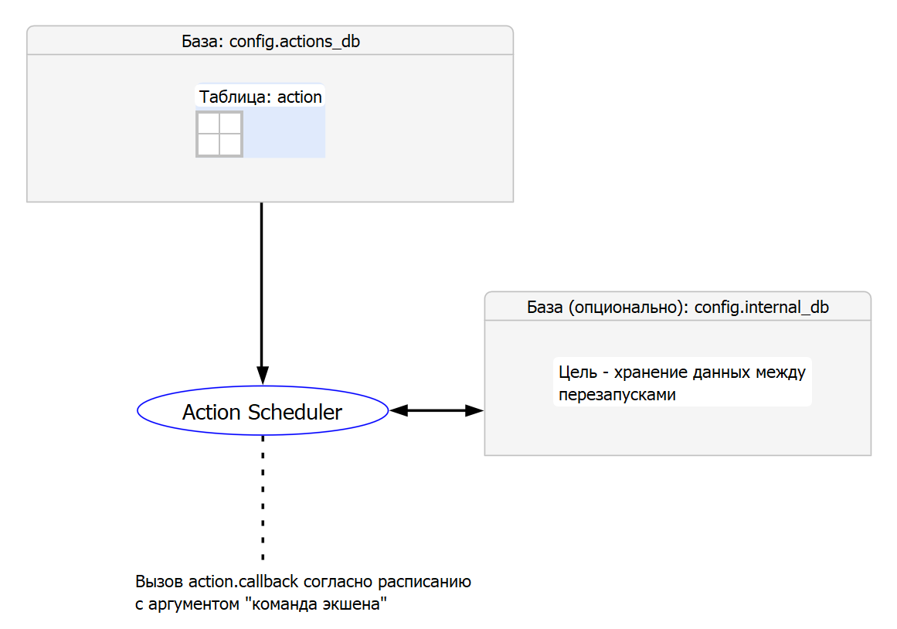

# Action Scheduler

`Action Scheduler` реализован Киреевым Виктором по техническому заданию, подготовленному Г. Ольгой.

TODO: Реализовать CLI

## Назначение

Программа предназначена для запуска определенных действий по расписанию. Действия задаются экшенами,
которые содержатся в таблице `action` базы `config.actions_db` (- параметр настройки, см. далее) и имеют следующие поля:

| Поле             | Описание |
| - | - |
| `name`           | имя экшена |
| `command`        | команда экшена, передается как аргумент в функцию `config.action.callback` |
| `cron`           | расписание, согласно которому будет вызвана функция `config.action.callback` с командной экшена |
| `merge_missed`   | `TRUE` - для замены пропущенных экшенов одним, `NONE` - использовать значение из `config.action.defaults.merge_missed`
| `actuality_time` | время актуальности пропущенного экшена в секундах (отрицательное значение эквивалентно бесконечности), `NONE` - использовать значение из `config.action.defaults.actuality_time` |

Пропущенные экшены появляются в момент перезапуска программы и т.д.



## Быстрый старт

- клонировать репо
- `cd action-scheduler`
- скопируйте конфигурационный файл `sample_configs/trivial/config.yaml` на уровень файла `README.md`
- `poetry install`
- `poetry shell`
- `poetry run python -m action_scheduler.main`

Примечание: возможно потребуется `sudo apt install libpq-dev` для `psycopg2`.

В `stdout` будут выводиться нотификации о работе двух экшенов (описание этих экшенов см. в `sample_actions.yaml`).

## Расписание

Расписание может задаваться в двух форматах:

- [unix (crontab)](https://www.ibm.com/docs/en/db2/11.5?topic=task-unix-cron-format)
- [apscheduler](https://apscheduler.readthedocs.io/en/3.x/modules/triggers/cron.html#module-apscheduler.triggers.cron)

Формат `apscheduler` позволяет задавать более гибкое расписание, включая диапазон дат, случайный jitter и др.

Пример задания расписания в этом формате на 0-ую, 20-ую, 40-ую секунду каждой минуты (со сроком окончания 2050-05-05):

```
{
    format: "apscheduler",
    params:
        second: "*/20"
        end_date: "2050-05-05"
}
```

## Конфигурация

Конфигурация берется (в порядке убывания приоритета) из следующих источников:

- переменные окружения
- .env файл
- config.yaml

Переменные окружения и константы в `.env` задаются в верхнем регистре, двойное подчеркивание
в названии (например, `ACTIONS_DB__DATABASE`) отделяет уровни вложенности.

Пример `config.yaml` из `sample_configs/practical/`:

```
debug: true
actions_db:
    dialect: postgresql
    driver: psycopg2
    username: postgres
    password: postgres
    host: localhost
    port: 5432
    database: postgres
track_changes_period: 15 # sec
internal_db:
    dialect: sqlite
    database: database.db
action:
    callback: action_scheduler.callbacks:kafka_send
    defaults:
        merge_missed: true
        actuality_time: 600
kafka:
    server: "localhost:1234"
    topic: some_topic
test:
    write_sample_actions_to_db: false
    print_apscheduler_jobs: false
    echo_actions_db_engine: false
```
